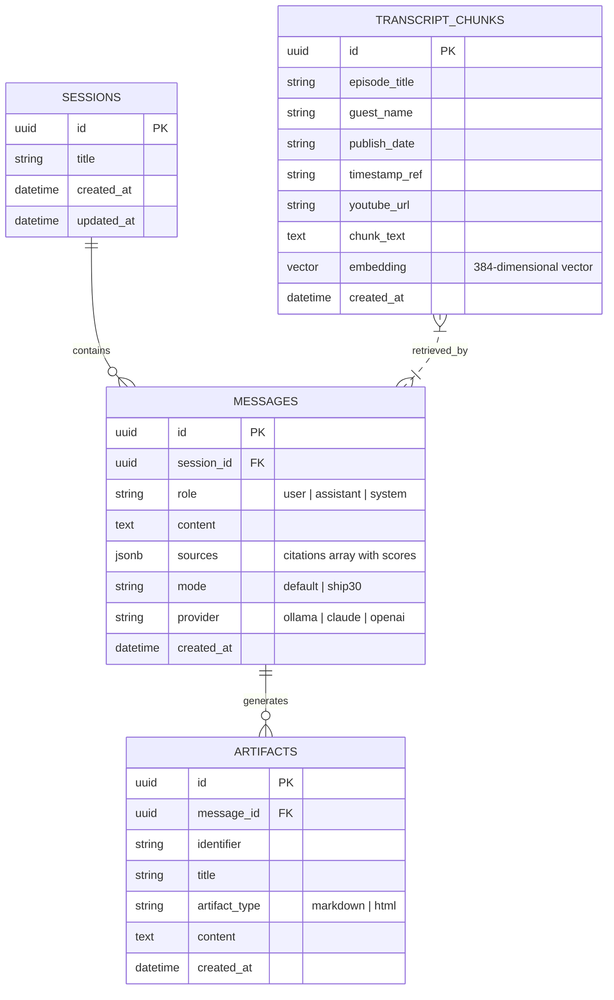

# System Architecture Document
## Project: The Lenny Growth Assistant
**Status:** Approved & Forward Deployed  
**Version:** 1.0.0  

---

## 1. High-Level Component Boundaries

The system is composed of five decoupled, highly cohesive subsystems:

```
+----------------------------------------------------------------------------------------------------+
|                                    CLIENT LAYER (Frontend UI)                                      |
|  - React 18 + TypeScript + Vite + Tailwind CSS                                                     |
|  - Split-Pane Chat Interface + Claude-Style Artifact Viewer (DOMPurify + Sandboxed Iframe)           |
+----------------------------------------------------------------------------------------------------+
                                           |
                                  HTTP / SSE Streaming
                                           v
+----------------------------------------------------------------------------------------------------+
|                                     FASTAPI ASGI BACKEND                                           |
|  - API Router: Sessions (/api/sessions), Streaming Chat (/api/chat), Health & Diagnostic (/api/health) |
|  - Agent & Skills Orchestrator: Grounded QA, Ship 30 for 30 Content Engine, Artifact Parser       |
+------------------------------------+-------------------------------+-------------------------------+
                                     |                               |
                   Provider Abstraction Layer                        | Vector Similarity Query
                                     |                               |
       +-----------------------------+-----------------------------+ |
       |                                                           | |
       v                                                           v v
+----------------------------+  +----------------------------+  +------------------------------------+
|     LOCAL LLM ENGINE       |  |      CLOUD LLM ENGINE      |  |         PERSISTENCE LAYER          |
|  - Ollama via HTTP API     |  |  - Anthropic Claude 3.5    |  |  - PostgreSQL 16 + pgvector        |
|  - Models: llama3.2,       |  |  - OpenAI GPT-4o           |  |  - HNSW Index (Cosine Distance)    |
|    llama3.1, mistral       |  |                            |  |  - Sessions, Messages, Artifacts  |
+----------------------------+  +----------------------------+  +------------------------------------+
```

---

## 2. Relational & Vector Database Schema

The persistence layer uses PostgreSQL 16 with the `pgvector` extension enabled.



### PostgreSQL Indexing Strategy
1. **Primary & Foreign Keys:** B-Tree index on `session_id` and `message_id`.
2. **Vector Cosine Indexing:**
   ```sql
   CREATE INDEX IF NOT EXISTS transcript_chunks_hnsw_idx 
   ON transcript_chunks 
   USING hnsw (embedding vector_cosine_ops)
   WITH (m = 16, ef_construction = 64);
   ```
   *HNSW (Hierarchical Navigable Small World)* provides logarithmic query latency ($\approx 3\text{--}8\text{ms}$) across thousands of chunks, outperforming IVFFlat without requiring periodic retraining.

---

## 3. Ingestion & Retrieval Pipeline

### 3.1 Ingestion Flow (`backend/scripts/ingest.py`)
1. **Source Parsing:** Reads markdown files from `backend/data/transcripts/`.
2. **Metadata Extraction:** Extracts YAML frontmatter (`guest`, `title`, `youtube_url`, `publish_date`, `keywords`).
3. **Recursive Chunking:**
   - Splits content into $500\text{--}800$ token blocks with $100$-token overlap.
   - Boundaries prioritize speaker turns (`Speaker (HH:MM:SS):`) and paragraph breaks (`\n\n`), preventing fragmented thoughts.
4. **Vector Embedding:** Computes 384-dimensional dense embeddings (`all-MiniLM-L6-v2` or nomic embeddings).
5. **Batch Insertion:** Upserts chunks and vectors into `transcript_chunks`.

### 3.2 Retrieval & Grounding Logic (`backend/app/rag/retriever.py`)
```sql
SELECT
    episode_title,
    guest_name,
    chunk_text,
    timestamp_ref,
    1 - (embedding <=> :vector::vector) AS similarity_score
FROM transcript_chunks
WHERE 1 - (embedding <=> :vector::vector) >= :threshold
ORDER BY similarity_score DESC
LIMIT :top_k;
```
- **Threshold Gating:** Similarity scores must meet $\ge 0.60$.
- **Refusal Trigger:** If no chunks meet the threshold, the system skips LLM completion and emits the grounded refusal:
  > *"I do not have sufficient information in Lenny's podcast archive to answer this."*

---

## 4. Multi-Provider Routing & Fallback Architecture

The backend implements the Strategy pattern through `BaseLLMProvider`:

```python
class BaseLLMProvider(ABC):
    @abstractmethod
    async def generate_response(
        self,
        messages: List[Dict[str, str]],
        system_prompt: str,
        temperature: float = 0.3
    ) -> AsyncGenerator[str, None]:
        pass
```

### Routing Matrix & Dynamic Toggle
- **Request-Level Control:** The frontend passes `provider` (`ollama`, `claude`, `openai`) in the request JSON payload or via the `X-LLM-Provider` header.
- **Health-Aware Fallback Routine:**
  1. If `provider == "ollama"`: Verifies connection to `OLLAMA_BASE_URL`. If unreachable or timeout occurs, logs a structured warning and yields a clear diagnostic token stream or falls back to configured cloud credentials.
  2. If `provider == "claude"` or `"openai"`: Verifies that the respective API key is present in environment variables. If absent, gracefully handles the missing key and reports actionable instructions.
  3. **Zero-Setup Evaluator Mode:** A deterministic, context-grounded provider is bundled to guarantee 100% demo functionality in any offline environment.

---

## 5. Security & Sandboxing Strategy

Treating AI-generated artifacts as untrusted user input is a fundamental requirement:

```
[ LLM Stream ] 
      |
      v
[ Artifact Parser ] --> extracts <artifact type="html" title="...">
      |
      v
[ Client DOMPurify ] --> strips unsafe XSS vectors, hooks, and malformed tags
      |
      v
[ Sandboxed <iframe> ]
   - srcDoc={cleanHtml}
   - sandbox="allow-scripts"
   - STRICTLY OMIT "allow-same-origin"
```

### Security Boundary Rationale
1. **Omission of `allow-same-origin`:** Ensures the iframe executes in a unique, null-origin security context. The sandboxed code **cannot**:
   - Access `document.cookie` of the parent application.
   - Access `localStorage` or `sessionStorage` containing session IDs or auth tokens.
   - Access the parent DOM via `window.parent` or navigate top-level windows.
2. **`allow-scripts` Flag:** Permits standard JavaScript execution required for interactive product calculators, charts, and interactive tabs.
3. **DOMPurify Sanitization:** Prevents script-gadget exploits and malicious URL schemas (`javascript:void(0)`).

---

## 6. API Contracts & Endpoints

### 6.1 `GET /api/health`
**Response:**
```json
{
  "status": "healthy",
  "database": { "connected": true, "dialect": "postgresql", "pgvector_enabled": true },
  "ollama": { "available": true, "url": "http://localhost:11434", "models": ["llama3.2:3b"] },
  "cloud": { "anthropic_configured": true, "openai_configured": false },
  "retrieval": { "total_indexed_chunks": 420 }
}
```

### 6.2 `POST /api/chat` (SSE Stream)
**Request:**
```json
{
  "session_id": "3fa85f64-5717-4562-b3fc-2c963f66afa6",
  "message": "What is Brian Chesky's advice on founder mode?",
  "mode": "default",
  "provider": "ollama"
}
```
**SSE Event Stream:**
```
event: status
data: {"type": "status", "content": "Searching transcripts..."}

event: sources
data: {"type": "sources", "content": [{"episode": "Brian Chesky's new playbook", "guest": "Brian Chesky", "timestamp": "00:00:00", "score": 0.89}]}

event: token
data: {"type": "token", "content": "Brian Chesky emphasizes that "}

event: artifact
data: {"type": "artifact", "title": "Founder Mode Playbook", "artifact_type": "markdown", "content": "..."}

event: done
data: [DONE]
```

---

## 7. Deployment Topology (Docker Compose)

```yaml
services:
  db:
    image: pgvector/pgvector:pg16
    ports: ["5432:5432"]
    healthcheck: { test: ["CMD-SHELL", "pg_isready -U postgres"] }

  backend:
    build: ./backend
    ports: ["8000:8000"]
    depends_on: { db: { condition: service_healthy } }
    environment:
      - DATABASE_URL=postgresql+asyncpg://postgres:password123@db:5432/lenny_assistant
      - OLLAMA_BASE_URL=http://host.docker.internal:11434

  frontend:
    build: ./frontend
    ports: ["3000:3000"]
    depends_on: ["backend"]
    environment:
      - VITE_API_URL=http://localhost:8000
```
